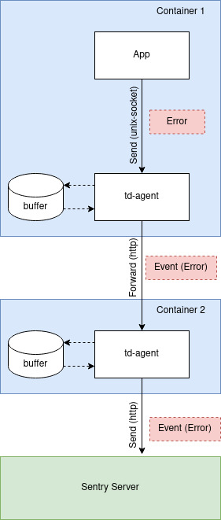

# Транспортировка событий из приложения в Sentry через td-agent

Внедрение промежуточных узлов `td-agent` на пути доставки события ошибки от приложения до _Sentry_ гарантирует:
* быструю отправку события (`unix-сокет` vs `http`)
* доставку до сервера _Sentry_ когда он будет доступен


## Инфраструктура

Инфраструктура состоит из двух контейнеров:
* приложение на `php`, которое создает ошибку, в этом же контейнере работает `td-agent` прослушивая `unix-сокет` куда приложение отправляет событие ошибки. Локальный `td-agent` перенаправляет событие в следующий `td-agent`
* `td-agent` который отправляет событие в _Sentry_

> Использование нескольких `td-agent'ов` сделано для демонстрации возможности прохождения события ошибки через несколько узлов `td-agent`.

Движение события ошибки от приложения по узлам `td-agent` до сервера `Sentry` изображено на схеме ниже:



Буферизация события ошибки возможна на любом узле `td-agent` что гарантирует в случае недоступности сервера _Sentry_ буферизация на диск будет осуществляться на подходящем для этого сервере (при условии его доступности) и событие будет доставлено до _Sentry_.


## Клиент Sentry

На стороне приложения необходимо обеспечить транспортировку события ошибки через `td-agent`. Для этого необходимо подменить дефолтный `http-транспорт`. Детали реализации в [src](/src).


## Использование

Поднять инфраструктуру:
```bash
$ export SENTRY_ADDR="http://sentry.local:9000"
$ export SENTRY_DSN="dsn"
$ docker compose up -d
```

Теперь можно зайти в контейнер с приложением и сгенерировать событие ошибки:
```bash
$ docker compose exec app php -f /var/www/html/src/index.php
```

В ответ будет распечатка объекта с идентификатором события:
```php
object(Sentry\EventId)#61 (1) {
["value":"Sentry\EventId":private]=>
string(32) "5a2c307521e147859af5b86d165d97cd"
}
```

> Если в ответ NULL значит что-то пошло не так ...

После прохождения через все узлы `td-agent` событие будет отправлено в `Sentry`.
